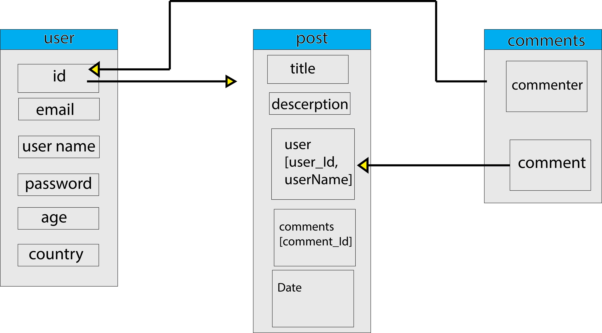

<h3 align="center">Friends</h3>

<p align="center"> Social media platform (friends)
</p>

## 📝 Table of Contents

- [About](#about)
- [Getting Started](#getting_started)
- [Usage](#usage)
- [Built Using](#built_using)
- [Guided By](#guided_by)

## About <a name = "about"></a>

A social networking platform that allows you to share your opinion, photos and writings with the whole world and allows you to meet new people in your life.
<br>
<br>
A communication platform that allows you to share your posts, ideas, and personal photos, edit them, and share your comments on other friends' posts.

## User Story <a name = "about"></a>

- [Trello](https://trello.com/b/NGOIGALK/project-4)
  <br>

## Data Flow <a name = "about"></a>

  <br>

</a>

## 🏁 Getting Started <a name = "getting_started"></a>

### Prerequisites

```

- axios
- mongoose
- bcryptjs
- jwt
- react-modal
- react-icons
- cloudinary
- cloudinary-react
- react-router-dom
```

### Installing

A step by step series of examples that tell you how to get a development env running.

```
1- clone the repo
2- open gitbash on backend file and write npm i to build the application
3- run the application on the frontend file by using npm start
4- run the backend server by npm run dev
5- install the data-base mongoDB


```

```
after you clone the repo to your computer and installing the Prerequisites. after this you should have package.json in your application that will contain the packages that will be required in this application.
```

## 🎈 Usage <a name="usage"></a>

```
1- you can Add post 
2- you upload you personal photo
3- you can comment and share your opinion with your friends
4- you can update and delete your posts if you own the account

```

## ⛏️ Built Using <a name = "built_using"></a>

- [MongoDB](https://www.mongodb.com/) - Database
- [Express JS](https://expressjs.com/) - Server Framework
- [React JS](https://https://reactjs.org/) - Web Framework
- [Node JS](https://nodejs.org/en/) - Server Environment
- [Cloudinary](https://cloudinary.com/) - cloudinary to upload profile picture

## ⚠️ Guided By <a name = "guided_by"></a>

This project is guided by ©️ **[MERAKI Academy](https://www.meraki-academy.org)**
